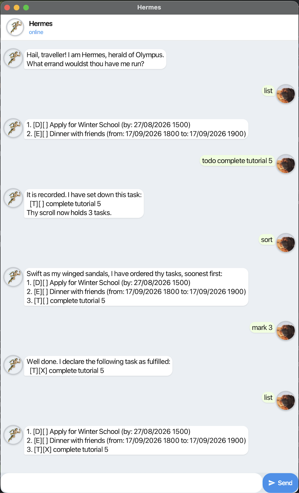

# Hermes User Guide

Hermes is a task manager that runs in one window on your desktop. Type a
line and read the reply. Hermes saves the change as you make it. Keep todos,
deadlines and events on one list, order it with twelve short commands and
undo any change you regret.



Contents
---
- [Getting Started](#getting-started)
- [Overview of Commands](#overview-of-commands)
- [Features](#features)
- [Commands in Detail](#commands-in-detail)
  - [Adding a todo](#adding-a-todo-todo)
  - [Adding a deadline](#adding-a-deadline-deadline)
  - [Adding an event](#adding-an-event-event)
  - [Listing all tasks](#listing-all-tasks-list)
  - [Marking a task as done](#marking-a-task-as-done-mark)
  - [Marking a task as not done](#marking-a-task-as-not-done-unmark)
  - [Deleting tasks](#deleting-tasks-delete)
  - [Finding tasks by keyword](#finding-tasks-by-keyword-find)
  - [Seeing what falls due](#seeing-what-falls-due-due)
  - [Sorting the list](#sorting-the-list-sort)
  - [Undoing the last change](#undoing-the-last-change-undo)
  - [Leaving](#leaving-bye)
- [Dates Hermes Understands](#dates-hermes-understands)
- [Saving Your Tasks](#saving-your-tasks)

Getting Started
---
1. Ensure you have **Java 25** or higher installed on your local device.
   - Check with:
     ```
     java -version
     ```
2. Download the latest version of hermes.jar by clicking this [link](https://github.com/Haocheeks/ip/releases/download/v0.2/hermes.jar).
3. Save the JAR file in an empty folder.
4. Open your terminal and navigate to the directory where you saved the file.
5. Run the following command to start the chat interface.
   ```
   java -jar hermes.jar
   ```
6. A window will open with a greeting from Hermes. Type a command into the text box at the bottom and press Enter to begin using.

Overview of Commands
---

Hermes understands twelve commands. See
[Commands in Detail](#commands-in-detail) for each one in full.

| Command | What it does | Format                                        |
| --- | --- |-----------------------------------------------|
| `todo` | Add a task with no date | `todo <DESCRIPTION>`                          |
| `deadline` | Add a task due by a given moment | `deadline <DESCRIPTION> /by <DATE>`           |
| `event` | Add a task running from one moment to another | `event <DESCRIPTION> /from <DATE> /to <DATE>` |
| `list` | Show every task, numbered | `list`                                        |
| `mark` | Mark one or more tasks done | `mark <NUMBER>...`                            |
| `unmark` | Mark one or more tasks not done | `unmark <NUMBER>...`                          |
| `delete` | Remove one or more tasks | `delete <NUMBER>...`                          |
| `find` | Show the tasks whose description holds a word | `find <KEYWORD>`                              |
| `due` | Show what falls due by a given moment | `due /by <DATE>`                              |
| `sort` | Order the list, soonest first | `sort`                                        |
| `undo` | Step the list back to how it last stood | `undo`                                        |
| `bye` | Close Hermes | `bye`                                         |

Features
---

**Saves itself.** Hermes writes every change to disk as you make it. Close
the window at any point and the list is as you left it. See
[Saving Your Tasks](#saving-your-tasks).

**Reads several date formats.** `17/08/2026 1500`, `17-8-2026 15:00`,
`2026-08-17` and `17 Aug 2026 1500` all work. Hermes refuses a date that
does not exist, such as 30 February. See the [Dates Hermes Understands](#dates-hermes-understands)

**Warns about repeats.** Add a task already on the list and Hermes records
it, then says so:

```
Take heed: this task already stands upon thy scroll.
```

Commands in Detail
---

### Notes on the command format

- Words in `<UPPER_CASE>` are the parts you supply.
  For example, in `todo <DESCRIPTION>`, type `todo borrow book`.
- A trailing `...` means you can give more than one, separated by spaces.
  For example, `delete 1 3` removes two tasks at once.

### Adding a todo: `todo`

Adds a task with no date attached.

Format: `todo <DESCRIPTION>`

Example: `todo borrow book`

```
It is recorded. I have set down this task:
  [T][ ] borrow book
Thy scroll now holds 1 task.
```

### Adding a deadline: `deadline`

Adds a task that needs to be finished by a given moment.

Format: `deadline <DESCRIPTION> /by <DATE>`

Example: `deadline return book /by 17/08/2026 1500`

```
It is recorded. I have set down this task:
  [D][ ] return book (by: 17/08/2026 1500)
Thy scroll now holds 2 tasks.
```

### Adding an event: `event`

Adds an event running from one moment to another. Ensure that the end date is later than the
start date.

Format: `event <DESCRIPTION> /from <DATE> /to <DATE>`

Example: `event project meeting /from 18/08/2026 0900 /to 18/08/2026 1100`

```
It is recorded. I have set down this task:
  [E][ ] project meeting (from: 18/08/2026 0900 to: 18/08/2026 1100)
Thy scroll now holds 3 tasks.
```

### Listing all tasks: `list`

Shows every task, numbered. Use these numbers with `mark`, `unmark` and
`delete`.

Format: `list`

```
1. [T][ ] borrow book
2. [D][ ] return book (by: 17/08/2026 1500)
3. [E][ ] project meeting (from: 18/08/2026 0900 to: 18/08/2026 1100)
```

Read `[T]`, `[D]` and `[E]` as a todo, a deadline and an event. `[X]` means
done, `[ ]` means not done.

### Marking a task as done: `mark`

Marks the tasks named as done.

Format: `mark <NUMBER>...`

Example: `mark 1 2`

```
Well done. I declare the following task as fulfilled:
  [T][X] borrow book

The following task was already fulfilled:
  [D][X] return book (by: 17/08/2026 1500)
```

Hermes groups the tasks that were already done on their own. Those are the
numbers that changed nothing.

### Marking a task as not done: `unmark`

Marks the tasks named as not done.

Format: `unmark <NUMBER>...`

Example: `unmark 2`

```
As thou wishest. I declare the following task as unfulfilled:
  [D][ ] return book (by: 17/08/2026 1500)
```

### Deleting tasks: `delete`

Removes the tasks named. If any number names no task, Hermes deletes
nothing.

Format: `delete <NUMBER>...`

Example: `delete 1 3`

```
It is done. I have guided these tasks down to the Underworld:
  [T][X] borrow book
  [E][ ] project meeting (from: 18/08/2026 0900 to: 18/08/2026 1100)
Thy scroll now holds 1 task.
```

### Finding tasks by keyword: `find`

Shows every task whose description contains the word, whatever its case.
Give one word at a time.

Format: `find <KEYWORD>`

Example: `find book`

```
[D][ ] return book (by: 17/08/2026 1500)
```

### Seeing what falls due: `due`

Shows the outstanding tasks due no later than the moment you give, soonest
first. Todos and completed tasks never appear.

Format: `due /by <DATE>`

Example: `due /by 20/08/2026 2359`

```
[D][ ] return book (by: 17/08/2026 1500)
[E][ ] project meeting (from: 18/08/2026 0900 to: 18/08/2026 1100)
```

### Sorting the list: `sort`

Reorders the list: dated tasks soonest first, then undated tasks, then
completed ones. Hermes keeps the new order.

Format: `sort`

With `borrow book` already done:

```
Swift as my winged sandals, I have ordered thy tasks, soonest first:
1. [D][ ] return book (by: 17/08/2026 1500)
2. [E][ ] project meeting (from: 18/08/2026 0900 to: 18/08/2026 1100)
3. [T][X] borrow book
```

### Undoing the last change: `undo`

Steps the list back to how it stood before your last change. Repeat `undo`
to go further back. Commands that only read the list, such as `list` and
`find`, change nothing and are not stepped over.

Format: `undo`

After the `delete` above:

```
Fast like myself, I have reversed thy last deed. The scroll stands as such:
1. [D][ ] return book (by: 17/08/2026 1500)
2. [E][ ] project meeting (from: 18/08/2026 0900 to: 18/08/2026 1100)
3. [T][X] borrow book
```

### Leaving: `bye`

Closes Hermes.

Format: `bye`

```
Fare thee well. Shouldst thou have need of me, call, and I shall come swifter than the wind.
```

Dates Hermes Understands
---

Write a date in figures or with the month spelled out, with or without a
time. Hermes reads a date given without a time as the start of that day and
refuses a date that does not exist, such as `30/02/2026`.

| You type | Hermes reads |
| --- | --- |
| `17/08/2026 1500` | 17 August 2026, 3pm |
| `17/08/2026 15:00` | the same |
| `17-8-2026 1500` | the same |
| `2026-08-17 1500` | the same |
| `2026/08/17 15:00` | the same |
| `17 Aug 2026 1500` | the same |
| `Aug 17 2026 1500` | the same |
| `17/08/2026` | 17 August 2026, midnight |
| `2026-08-17` | the same |

Saving Your Tasks
---

Hermes saves after every change to `data/Hermes.txt`, in the folder you ran
it from. You never need to save by hand.

That file is plain text, so you can edit it yourself. Hermes sets aside any
line it cannot read and tells you how many it skipped when it starts. Those
lines are lost at the next save. Copy the file before editing it.
